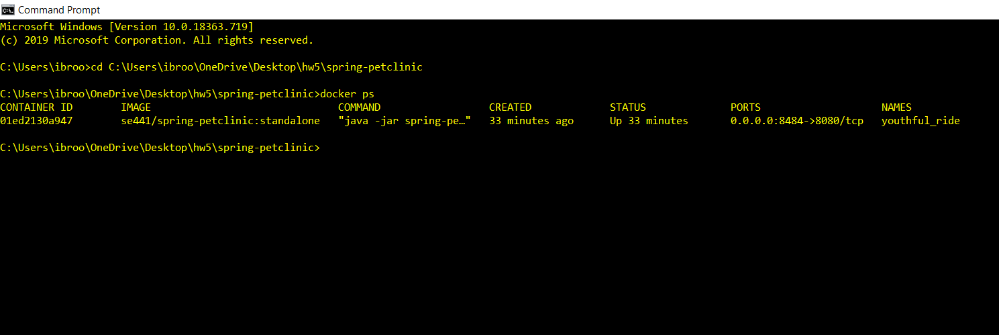
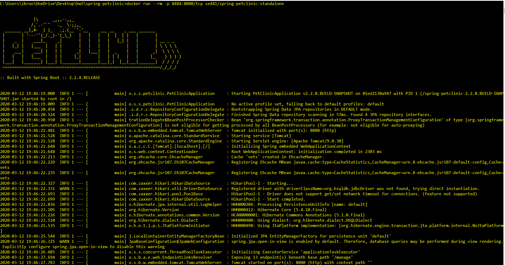
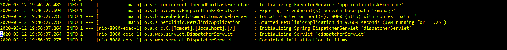
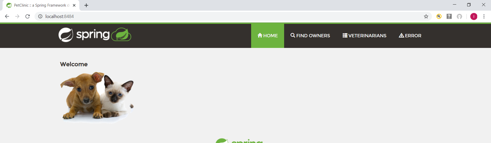

1. dockerfile. Please provide a link to this file rather than a screen capture.

https://github.com/ibrooo33/spring-petclinic/blob/master/Dockerfile

2. running docker instance as shown by a ps command. 

3. browser accessing the main page of the website from your local container.

